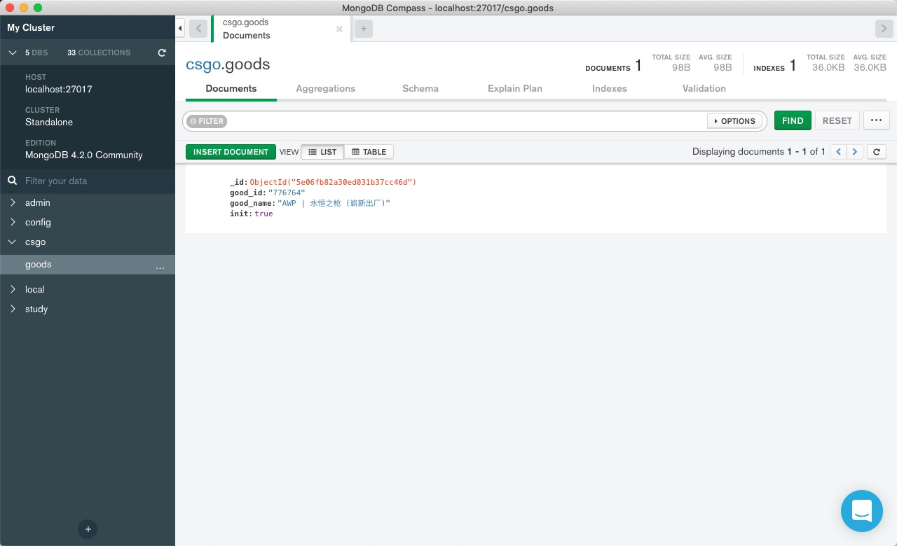

## 利用Python Scrapy框架进行CSGO饰品价格探测（仅供娱乐）

### 1. 进行MongoDB数据库创建

> 初始化goods collection创建，其中init字段标示是否继续初始化，即第一次不进行价格对比

### 2. 通过登陆Buff官网获取Session
> 通过F12控制台获取登陆用户的Session，在程序的settings.py中设置好session

### 3. 通过执行Scrapy命令进行价格探测

> 通过执行`scrapy crawl goods`进行数据探测，数据最终存储到MongoDB的Collection里

### 4. 波动邮件提示
> 程序会对比前后饰品价格波动，发生波动后会通过邮件进行同志
>
